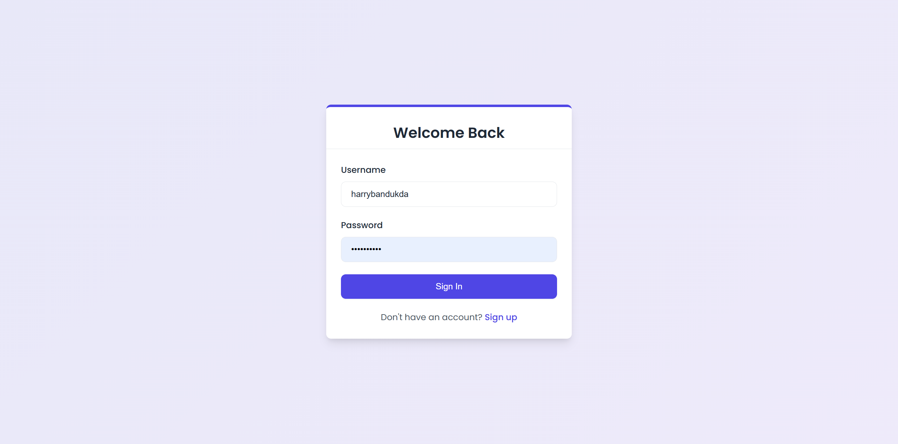
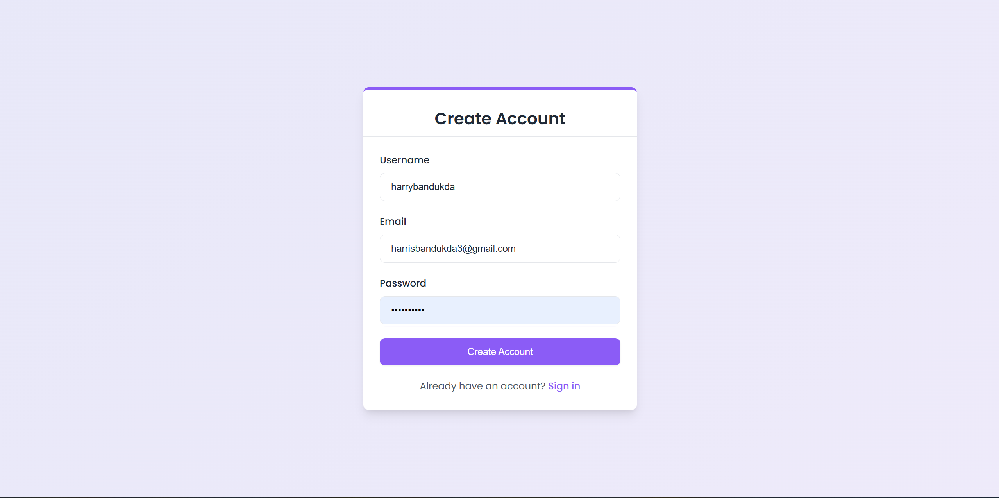
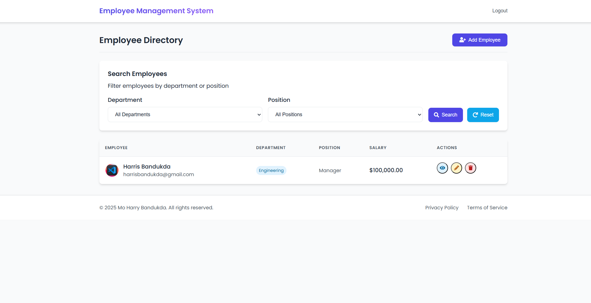

### COMP3133 Assignment Two

A modern full-stack application for managing employee data with authentication, search functionality, and CRUD operations.

## 🚀 Features

- **User Authentication**: Secure login and signup functionality
- **Employee Management**: Add, view, edit, and delete employee records
- **Search & Filter**: Find employees by department or position
- **Responsive Design**: Works seamlessly on desktop and mobile devices
- **Profile Images**: Upload and manage employee profile pictures


## 📸 Screenshots







## 🛠️ Technologies

### Frontend

- **Angular**: Modern, reactive UI framework
- **Apollo Client**: GraphQL client for data fetching
- **Responsive CSS**: Custom styling with modern design principles


### Backend

- **Node.js & Express**: Server framework
- **Apollo Server**: GraphQL server
- **MongoDB & Mongoose**: Database and ODM
- **JWT Authentication**: Secure user authentication


## 🔧 Installation & Setup

### Prerequisites

- Node.js (v14+)
- MongoDB
- Angular CLI


### Backend Setup

```shellscript
# Clone the repository
git clone https://github.com/Harrybandukda/101451857_comp3133_assignment2
cd 101451857_comp3133_assignment2

# Install backend dependencies
cd backend
npm install

# Set up environment variables
cp .env.example .env
# Edit .env with your MongoDB URI and JWT secret

# Start the server
npm start
```

### Frontend Setup

```shellscript
# Navigate to frontend directory
cd ../frontend

# Install frontend dependencies
npm install

# Start the Angular development server
ng serve
```

Visit `http://localhost:4200` to access the application.

## 🔑 Environment Variables

Create a `.env` file in the backend directory with the following variables:

```plaintext
MONGODB_URI=your_mongodb_connection_string
JWT_SECRET=your_jwt_secret_key
PORT=4000
```

## 📝 API Documentation

The backend provides a GraphQL API with the following main operations:

### Queries

- `getEmployees`: Fetch all employees
- `getEmployee(id)`: Fetch a specific employee
- `searchEmployees(department, position)`: Search employees by filters
- `getCurrentUser`: Get the currently authenticated user


### Mutations

- `signup(username, email, password)`: Register a new user
- `login(username, password)`: Authenticate a user
- `addEmployee(...)`: Create a new employee record
- `updateEmployee(...)`: Update an existing employee
- `deleteEmployee(id)`: Delete an employee


## 👥 User Flows

1. **Authentication**:

1. Users can register with username, email, and password
2. Login with username and password
3. JWT token is stored for authenticated requests


2. **Employee Management**:

1. View all employees in a responsive table
2. Search and filter by department or position
3. View detailed employee information
4. Add new employees with profile pictures
5. Edit existing employee details
6. Delete employees

---

Made with ❤️ by Mo Harry Bandukda